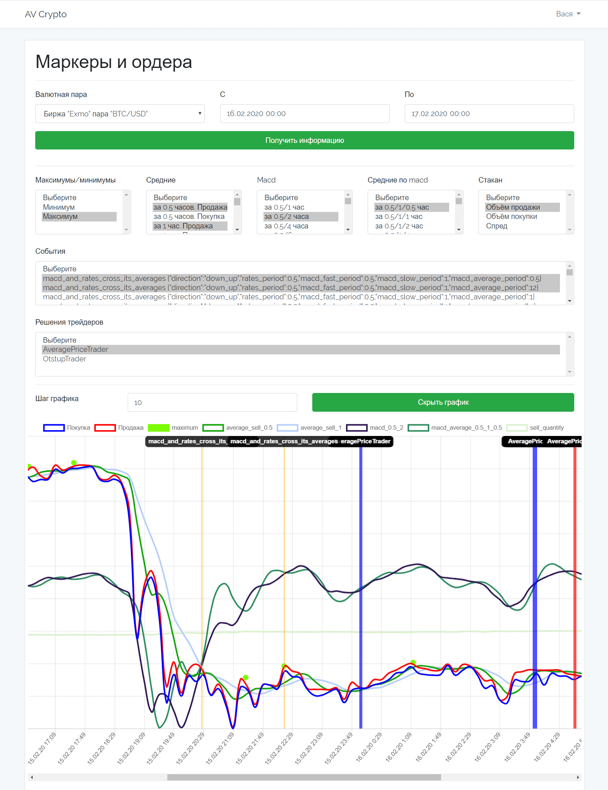
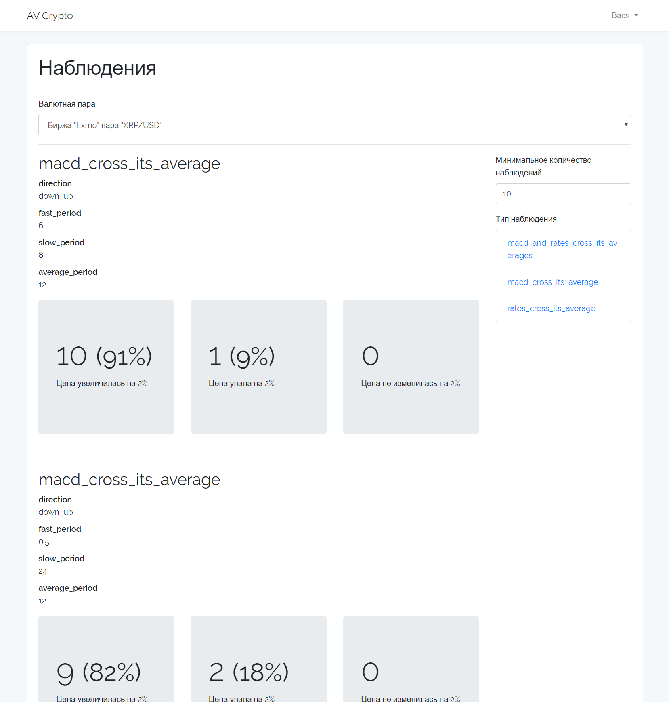

Личный проект по криптовалютному автотрейдингу. Создан в основном для самообучения 
Адрес https://av-crypto.ru (пока закрыт)

Personal cryptocurrency autotrading project. Designed primarily for self-learning  
Address https://av-crypto.ru (yet closed)

# Технологии (technologies)
* Laravel
* Vue.js
* Chart.js
* Redis

# Что проект может на текущий момент (What can the project do by now?)
## График (Chart)
Позволяет показать график котировок с выводом на него выбранных метрик и событий валютной пары, а также решений трейдеров для визуального анализа человеком.

It can show you a rates chart with the output of currency pair metrics and events and with trader decisions for visual analysis by a human.

## Наблюдения (Observations)
Позволяет вывести наблюдения по событиям валютных пар. У каждого события показывается количество раз, когда после его наступления цена менялась в большую сторону, меньшую или не менялась значительно.

It can show you currency pair events observations. Each event goes with the numbers of times when the price changed upward, downward or did not change significantly after its occurrence.
